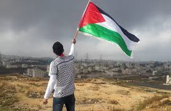

# Conflicto en palestina

## Inicio del conflicto

### Surgimiento del Conflicto
A fines del siglo XIX, el **sionismo** promovió el regreso de los judíos a Palestina, lo que generó tensiones con la población árabe local.

### Mandato Británico y Declaración Balfour
Tras la Primera Guerra Mundial, Palestina quedó bajo control británico. En 1917, la **Declaración Balfour** apoyaba un hogar nacional judío, incrementando el conflicto entre judíos y árabes.

### Creación de Israel (1948)
En 1948, se declaró el **Estado de Israel**, desatando la primera guerra árabe-israelí. Miles de palestinos fueron desplazados.

### Ocupación y Conflicto
En 1967, Israel ocupó Cisjordania y Gaza, agravando el conflicto, que sigue sin resolverse, con disputas por territorios y reconocimiento de un Estado palestino.

